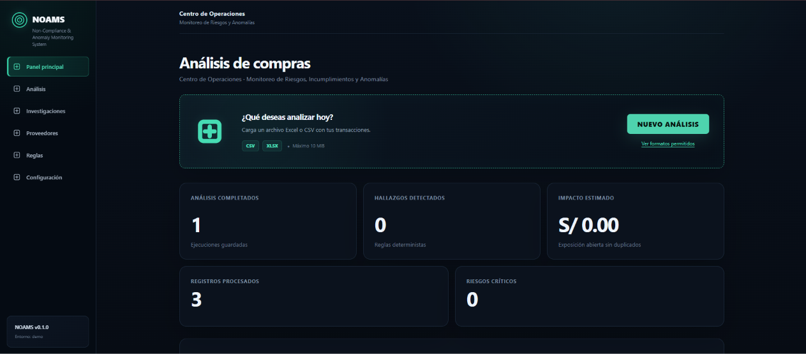
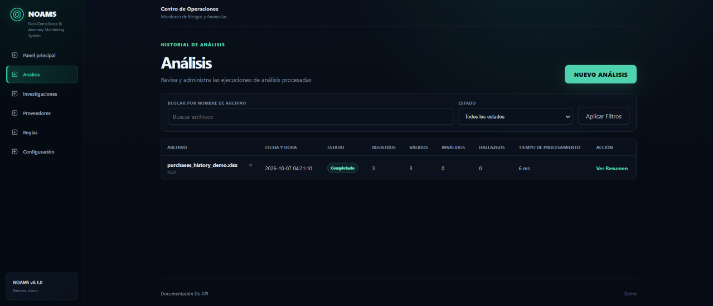
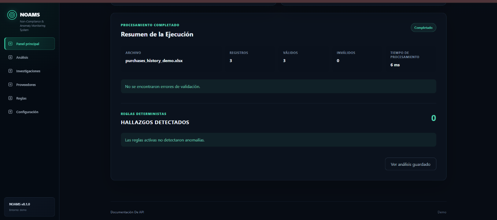
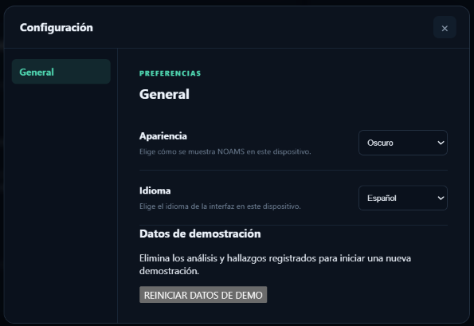

# NOAMS

Non-Compliance & Anomaly Monitoring System

## Descripción

NOAMS analiza transacciones de compras para identificar posibles anomalías e incumplimientos mediante reglas de negocio determinísticas. Separa los errores de calidad de datos de los hallazgos de negocio y conserva evidencia para priorizar revisiones.

La demo funciona localmente con datos completamente sintéticos. Los hallazgos son indicadores para revisión; el impacto estimado representa exposición, no una pérdida confirmada.

## Funcionalidades principales

- Importación de CSV UTF-8 y Excel XLSX, con límite de 10 MiB por archivo.
- Validación de columnas, fechas, campos obligatorios y valores numéricos; rechazo por fila con explicación.
- Normalización y persistencia de transacciones válidas.
- Ejecución de cinco reglas con severidad, evidencia e impacto estimado.
- Trazabilidad por análisis, transacción, fila de origen y configuración de la regla ejecutada.
- Dashboard con métricas e historial de análisis con filtros y detalle persistido.
- Consulta de hallazgos mediante API con filtros y paginación.
- Activación, configuración y restablecimiento de reglas desde la interfaz.
- Interfaz en español e inglés, con temas claro y oscuro.

## Reglas de análisis

| Regla | Criterio principal |
| --- | --- |
| Duplicate Purchase | Coincidencia de proveedor, orden de compra y monto en un análisis. |
| Unusual Supplier Amount | Monto elevado frente a la mediana del proveedor en análisis anteriores. |
| Budget Deviation | Monto superior al presupuesto positivo informado en la fila. |
| Purchase Without Valid Approval | Estado de aprobación pendiente, rechazado o no aprobado. |
| Potential Split Purchase | Compras agrupadas por proveedor, departamento y categoría que alcanzan un umbral en una ventana temporal. |

[Ver reglas detalladas](docs/rules.md)

## Tecnologías

Python · FastAPI · Uvicorn · SQLAlchemy · SQLite · Alembic · Pydantic · Jinja2 · HTML · CSS · JavaScript · OpenPyXL

Las pruebas utilizan Pytest y HTTPX. El motor aplica criterios determinísticos y comparaciones estadísticas simples; no entrena modelos.

## Vista del sistema

### Panel principal

Métricas de análisis, registros, hallazgos e impacto, con acceso a una nueva carga CSV o XLSX.



### Historial de análisis

Consulta de ejecuciones guardadas, con filtros por nombre de archivo y estado y acceso al resumen.



### Resumen de ejecución

Resultado del archivo histórico de ejemplo: tres registros válidos, sin errores ni hallazgos.



### Reglas

Catálogo con activación, configuración actual y estadísticas de ejecución por regla.


### Configuración y datos de demostración

Preferencias de apariencia e idioma y acceso al reinicio de los registros de la demo.



## Arquitectura

```text
Navegador: HTML / CSS / JavaScript
    ↓ HTTP y formularios de carga
FastAPI + plantillas Jinja2
    ↓
Validación → normalización → motor de reglas
    ↓
SQLAlchemy → SQLite
    ↑
Alembic: migraciones de esquema
```

El frontend se sirve desde el mismo backend; no requiere un proceso separado ni herramientas de compilación JavaScript.

[Ver arquitectura detallada](docs/architecture.md)

## Ejecutar la demo

Requiere Python 3.11 o superior. Desde la raíz del proyecto:

```bash
python -m venv .venv
```

Activar en Windows PowerShell:

```powershell
.\.venv\Scripts\Activate.ps1
```

Activar en macOS o Linux:

```bash
source .venv/bin/activate
```

Instalar, generar ejemplos e iniciar:

```bash
python -m pip install -r requirements.txt
python demo/generate_demo_data.py
python -m uvicorn app.main:app --host 127.0.0.1 --port 8001
```

Abrir [la interfaz local](http://127.0.0.1:8001) o [la API interactiva](http://127.0.0.1:8001/docs). El arranque crea la base demo, aplica migraciones y registra las cinco reglas. No requiere credenciales ni configuración privada.

Para recorrer las cinco reglas desde la interfaz, cargar primero `demo/sample_data/purchases_history_demo.csv` y después `demo/sample_data/purchases_demo.csv`. El primer archivo aporta tres observaciones históricas; el segundo produce cinco hallazgos con la configuración inicial. Los equivalentes XLSX contienen los mismos registros.

También se puede preparar una base con ambos análisis antes del arranque:

```bash
python demo/seed_database.py
```

Este script sólo carga una base sin análisis y no duplica datos al repetirlo. La base se guarda en `data/noams-demo.db` dentro de esta copia y queda excluida de Git. La demo rechaza ubicaciones externas de base de datos y archivos cargados.

Para ejecutar las pruebas:

```bash
python -m pip install -r requirements-dev.txt
python -m pytest -q
```

## Datos de demostración

Todos los registros, proveedores, órdenes, fechas y montos son ficticios y se generan por código. No contienen compras, documentos ni información de proveedores reales. Se utilizan exclusivamente con fines demostrativos.

- `purchases_history_demo`: tres compras normales para establecer la mediana histórica.
- `purchases_demo`: ocho compras; cinco casos de detección y un registro normal, además de las filas necesarias para duplicidad y agrupación.
- `purchases_normal_demo`: una compra sin hallazgos.
- `purchases_validation_demo`: una fila válida y otra con errores de fecha, cantidad y montos.

Cada ejemplo se distribuye en CSV y XLSX. La regeneración de archivos no modifica los análisis ya guardados. Una carga repetida crea otra ejecución y afecta el histórico disponible.

## Estructura del proyecto

```text
app/                  Backend, reglas, plantillas y recursos del frontend
alembic/              Migraciones
alembic.ini           Configuración de migraciones
demo/                 Generación de datos y carga inicial
  sample_data/        CSV y XLSX sintéticos
docs/                 Documentación técnica
screenshots/          Vistas del sistema
tests/                Pruebas automatizadas
requirements.txt      Dependencias de ejecución
requirements-dev.txt  Dependencias de pruebas
data/                 Persistencia local generada
```

## Documentación

- [Arquitectura](docs/architecture.md)
- [Funcionalidades](docs/features.md)
- [Reglas](docs/rules.md)
- [Validación y limitaciones](docs/validation.md)
